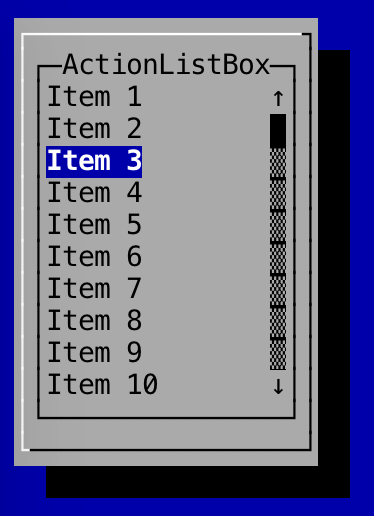

Action List Box
---

An action list box stores a list of actions the user can made. Each action runs within its own thread.

To create an action list:

```
	TerminalSize size = new TerminalSize(14, 10);
	ActionListBox actionListBox = new ActionListBox(size);
```

To add an action to the `ActionListBox`:

```
	actionListBox.addItem(itemText, new Runnable() {
		@Override
		public void run() {
			// Code to run when action activated
		}
	});
```

### Screenshot

