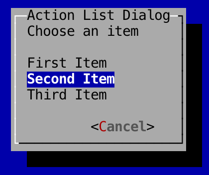

Action List Dialogs
---

Action list dialogs are pop-up windows that allow users to choose from a list of predetermined actions.

To create an action list dialog, as with all dialogs, you'll need to create and pass in a `WindowBasedTextGUI`:

```
	// Setup terminal and screen layers
	Terminal terminal = new DefaultTerminalFactory().createTerminal();
	Screen screen = new TerminalScreen(terminal);
	screen.startScreen();

	// Setup WindowBasedTextGUI for dialogs
	final WindowBasedTextGUI textGUI = new MultiWindowTextGUI(screen);
```

In the following example, an action list dialog box is shown to the user when the button is clicked. When a user activates an action in the list, the corresponding thread is ran.

```
	new ActionListDialogBuilder()
		.setTitle("Action List Dialog")
		.setDescription("Choose an item")
		.addAction("First Item", new Runnable() {
		    @Override
		    public void run() {
		        // Do 1st thing...
		    }
		})
		.addAction("Second Item", new Runnable() {
		    @Override
		    public void run() {
		        // Do 2nd thing...
		    }
		})
		.addAction("Third Item", new Runnable() {
		    @Override
		    public void run() {
		        // Do 3rd thing...
		    }
		})
		.build()
		.showDialog(textGUI);
```

### Screenshot

