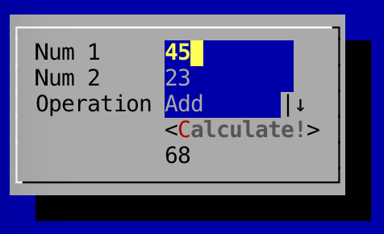

Basic Form Submission Example
---

The last example was pretty boring, to say the least. A much more interesting example would be one that involves interaction!

In this example, we'll create a simple calculator.

```
package com.googlecode.lanterna.gui2;

import com.googlecode.lanterna.TerminalSize;
import com.googlecode.lanterna.TextColor;
import com.googlecode.lanterna.screen.Screen;
import com.googlecode.lanterna.screen.TerminalScreen;
import com.googlecode.lanterna.terminal.DefaultTerminalFactory;
import com.googlecode.lanterna.terminal.Terminal;

import java.io.IOException;
import java.util.regex.Pattern;

public class Calculator {
    public static void main(String[] args) throws IOException {
        // Setup terminal and screen layers
        Terminal terminal = new DefaultTerminalFactory().createTerminal();
        Screen screen = new TerminalScreen(terminal);
        screen.startScreen();

        // Create panel to hold components
        Panel panel = new Panel();
        panel.setLayoutManager(new GridLayout(2));

        final Label lblOutput = new Label("");

        panel.addComponent(new Label("Num 1"));
        final TextBox txtNum1 = new TextBox().setValidationPattern(Pattern.compile("[0-9]*")).addTo(panel);

        panel.addComponent(new Label("Num 2"));
        final TextBox txtNum2 = new TextBox().setValidationPattern(Pattern.compile("[0-9]*")).addTo(panel);

        panel.addComponent(new EmptySpace(new TerminalSize(0, 0)));
        new Button("Add!", new Runnable() {
            @Override
            public void run() {
                int num1 = Integer.parseInt(txtNum1.getText());
                int num2 = Integer.parseInt(txtNum2.getText());
                lblOutput.setText(Integer.toString(num1 + num2));
            }
        }).addTo(panel);

        panel.addComponent(new EmptySpace(new TerminalSize(0, 0)));
        panel.addComponent(lblOutput);

        // Create window to hold the panel
        BasicWindow window = new BasicWindow();
        window.setComponent(panel);

        // Create gui and start gui
        MultiWindowTextGUI gui = new MultiWindowTextGUI(screen, new DefaultWindowManager(), new EmptySpace(TextColor.ANSI.BLUE));
        gui.addWindowAndWait(window);
    }
}
```

Running the above code will show the user a simple form, showing two text boxes that only accept numbers and a button which, when activated (pressing the Enter key), will add the two numbers in the text boxes and set the text of the output label to the result.

Hmm... this example is ok, but what if we wanted to do more than just add numbers? Let's add a combobox which allows the user to select between addition and subtraction:

```
import com.googlecode.lanterna.TerminalSize;
import com.googlecode.lanterna.TextColor;
import com.googlecode.lanterna.screen.Screen;
import com.googlecode.lanterna.screen.TerminalScreen;
import com.googlecode.lanterna.terminal.DefaultTerminalFactory;
import com.googlecode.lanterna.terminal.Terminal;

import java.io.IOException;
import java.util.regex.Pattern;

public class Calculator {
    public static void main(String[] args) throws IOException {
        // Setup terminal and screen layers
        Terminal terminal = new DefaultTerminalFactory().createTerminal();
        Screen screen = new TerminalScreen(terminal);
        screen.startScreen();

        // Create panel to hold components
        Panel panel = new Panel();
        panel.setLayoutManager(new GridLayout(2));

        final Label lblOutput = new Label("");

        panel.addComponent(new Label("Num 1"));
        final TextBox txtNum1 = new TextBox().setValidationPattern(Pattern.compile("[0-9]*")).addTo(panel);

        panel.addComponent(new Label("Num 2"));
        final TextBox txtNum2 = new TextBox().setValidationPattern(Pattern.compile("[0-9]*")).addTo(panel);

        panel.addComponent(new Label("Operation"));
        final ComboBox<String> operations = new ComboBox<String>();
        operations.addItem("Add");
        operations.addItem("Subtract");
        panel.addComponent(operations);

        panel.addComponent(new EmptySpace(new TerminalSize(0, 0)));
        new Button("Calculate!", new Runnable() {
            @Override
            public void run() {
                int num1 = Integer.parseInt(txtNum1.getText());
                int num2 = Integer.parseInt(txtNum2.getText());
                if(operations.getSelectedIndex() == 0) {
                    lblOutput.setText(Integer.toString(num1 + num2));
                } else if(operations.getSelectedIndex() == 1) {
                    lblOutput.setText(Integer.toString(num1 - num2));
                }
            }
        }).addTo(panel);

        panel.addComponent(new EmptySpace(new TerminalSize(0, 0)));
        panel.addComponent(lblOutput);

        // Create window to hold the panel
        BasicWindow window = new BasicWindow();
        window.setComponent(panel);

        // Create gui and start gui
        MultiWindowTextGUI gui = new MultiWindowTextGUI(screen, new DefaultWindowManager(), new EmptySpace(TextColor.ANSI.BLUE));
        gui.addWindowAndWait(window);
    }
}

```

The best way to get to grips with Lanterna is to experiment. Using the examples above, try adding more operations to the combo box, or producing a new way to display the result.

### Screenshot

Here's a screenshot of the finished calculator:

