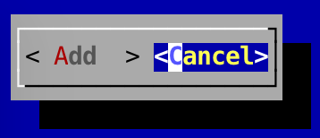

Buttons
---

Buttons have a label and a callback.

To create a simple button, with no callback:

```
	Button button = new Button("Enter");
```

You can also create a button with a callback:

```
	Button button = new Button("Enter", new Runnable() {
		@Override
		public void run() {
			// Actions go here
		}
	});
```

As you can see, the callback runs in its own thread.

Pressing the `Enter` key on the keyboard when the button is highlighted will trigger the callback.

### Screenshot

