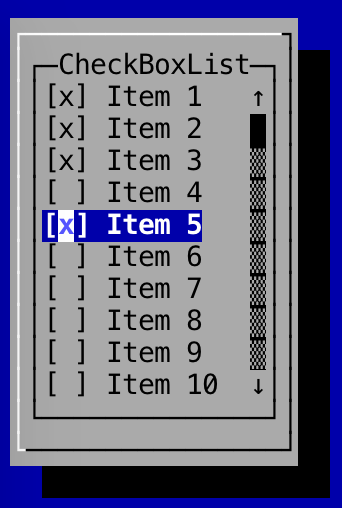

Check Boxes
---

Check boxes allow users to select multiple items at once. Check boxes appear in a list. To create a `CheckBox`:

```
	TerminalSize size = new TerminalSize(14, 10);
	CheckBoxList<String> checkBoxList = new CheckBoxList<String>(size);
```

To add checkboxes to a list:

```
	checkBoxList.addItem("item 1");
	checkBoxList.addItem("item 2");
	checkBoxList.addItem("item 3");
```

To get a list of selected items:

```
	List<String> checkedItems = checkBoxList.getCheckedItems();
```

You can also check if a particular index is checked:

```
	boolean result = checkBoxList.isChecked(2);
```

### Screenshot

