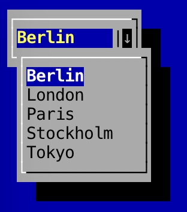

Combo boxes
---

To create a new combo box:

```
	ComboBox<String> comboBox = new ComboBox<String>();
```

To add items to a `ComboBox`, call `addItem()`:

```
	comboBox.addItem("item 1");
	comboBox.addItem("item 2");
	comboBox.addItem("item 3");
```

To get the currently selected index:

```
	// Returns an integer value
	comboBox.getSelectedIndex();
```

To mark the combo box as read-only:

```
	ComboBox<String> comboBox = new ComboBox<String>().setReadOnly(false);
```

`setReadOnly` returns the instance of the combo box just created. This is so that methods can be chained together.

As with all components, you can set the preferred size via `setPreferredSize`:

```
	comboBox.setPreferredSize(new TerminalSize(15, 1));
```

This will set the width of the combo box to be 15 characters wide. You can also change the height of the combo box if you so wish.

When the user highlights the combo box and presses the `Enter` key on the keyboard, the list of selectable items will show.

### Screenshots

#### Non-activated:


#### Activated:

