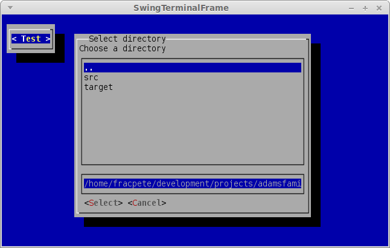

Directory Dialogs
---

Directory dialogs are pop-up windows that allow users to choose directories from the user's system.

To create a directory dialog, as with all dialogs, you'll need to create and pass in a `WindowBasedTextGUI`:

```java
	// Setup terminal and screen layers
	Terminal terminal = new DefaultTerminalFactory().createTerminal();
	Screen screen = new TerminalScreen(terminal);
	screen.startScreen();

	// Setup WindowBasedTextGUI for dialogs
	final WindowBasedTextGUI textGUI = new MultiWindowTextGUI(screen);
```

In the following example, a direcotry dialog is shown to the user when the button is clicked. 
When the user selects and submits a directory, the full file path of the selected directory 
is returned and stored in the variable `input` and printed to stdout:

```java
	panel.addComponent(new Button("Test", new Runnable() {
		@Override
		public void run() {
			File input = new DirectoryDialogBuilder()
				.setTitle("Select directory")
				.setDescription("Choose a directory")
				.setActionLabel("Select")
				.build()
				.showDialog(textGUI);
			System.out.println(input);
		}
	}));
```

### Screenshot

