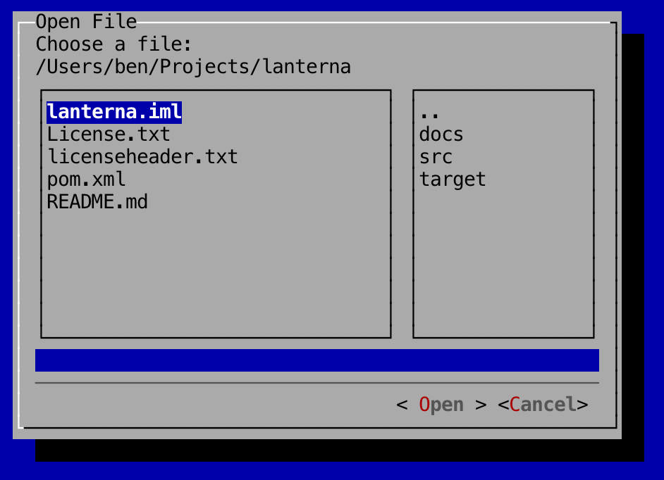

File Dialogs
---

File dialogs are pop-up windows that allow users to choose files from the user's system.

To create an file dialog, as with all dialogs, you'll need to create and pass in a `WindowBasedTextGUI`:

```
	// Setup terminal and screen layers
	Terminal terminal = new DefaultTerminalFactory().createTerminal();
	Screen screen = new TerminalScreen(terminal);
	screen.startScreen();

	// Setup WindowBasedTextGUI for dialogs
	final WindowBasedTextGUI textGUI = new MultiWindowTextGUI(screen);
```

In the following example, a file dialog is shown to the user when the button is clicked. When the user selects and submits a file, the full file path of the selected file is returned and stored in the variable `input`:

```
	panel.addComponent(new Button("Test", new Runnable() {
		@Override
		public void run() {
			String input = new FileDialogBuilder()
								.setTitle("Open File")
								.setDescription("Choose a file")
								.setActionLabel("Open")
								.build()
								.showDialog(textGUI);
		}
	}));
```

### Screenshot

