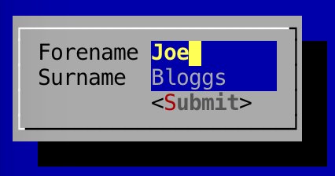

Hello World - GUI Example
---

In this initial example, we take a look at a basic GUI window which contains a couple of components.
There is little to no interactivity in this example, however, it should be a good starting point as it demonstrates
how easy it is to build up interfaces. If you're familiar with Java Swing, you'll feel right at home with Lanterna.

```
import com.googlecode.lanterna.TerminalSize;
import com.googlecode.lanterna.TextColor;
import com.googlecode.lanterna.gui2.*;
import com.googlecode.lanterna.screen.Screen;
import com.googlecode.lanterna.screen.TerminalScreen;
import com.googlecode.lanterna.terminal.DefaultTerminalFactory;
import com.googlecode.lanterna.terminal.Terminal;

import java.io.IOException;

public class HelloWorld {
    public static void main(String[] args) throws IOException {

        // Setup terminal and screen layers
        Terminal terminal = new DefaultTerminalFactory().createTerminal();
        Screen screen = new TerminalScreen(terminal);
        screen.startScreen();

        // Create panel to hold components
        Panel panel = new Panel();
        panel.setLayoutManager(new GridLayout(2));

        panel.addComponent(new Label("Forename"));
        panel.addComponent(new TextBox());

        panel.addComponent(new Label("Surname"));
        panel.addComponent(new TextBox());

        panel.addComponent(new EmptySpace(new TerminalSize(0,0))); // Empty space underneath labels
        panel.addComponent(new Button("Submit"));

        // Create window to hold the panel
        BasicWindow window = new BasicWindow();
        window.setComponent(panel);

        // Create gui and start gui
        MultiWindowTextGUI gui = new MultiWindowTextGUI(screen, new DefaultWindowManager(), new EmptySpace(TextColor.ANSI.BLUE));
        gui.addWindowAndWait(window);

    }
}
```

### Screenshot

Here's a screenshot of the above code, running:

