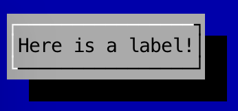

Labels
---

Labels, as you may expect, are simple labels.

To create a simple label:

```
	Label label = new Label("Here is a label");
```

As with many other components, you can add a `Label` to a `Panel` after instantiation:

```
	Panel panel = new Panel();
	new Label("Surname").addTo(panel);
```

### Screenshot

