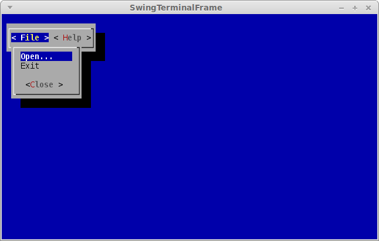

Menus
---

Menus consists of basically three components:

* *menu bar* - contains one or more drop-down menus
* *menu* - contains one or more menu items
* *menu item* - a label associated with an action

The menu bar itself is just a panel with buttons that pop up an action-list-like
dialog window beneath the button, aka the menu, that just got clicked. This 
dialog window contains all the menu items that were added to this menu.
The menu can be closed via the *Close* button at the bottom.

You can either add menu items using objects that implement the `MenuItem` 
interface via the `addMenuItem(MenuItem)` method or simply call the 
`addMenuItem(String,Runnable)` method which just takes the label of the menu 
item and the action to execute when clicked.

To create a menu, you'll need to create and pass in a `WindowBasedTextGUI`:

```java
    Terminal terminal = new DefaultTerminalFactory().createTerminal();
    Screen screen = new TerminalScreen(terminal);
    screen.startScreen();

    final MultiWindowTextGUI gui = new MultiWindowTextGUI(
            screen, new DefaultWindowManager(), new EmptySpace(TextColor.ANSI.BLUE));
```

In the following example, a menu bar with two menus, *File* and *Help*, is 
created, each containing two menu items:

```java
        MenuBar menubar = new MenuBar();
        
        // "File" menu
        Menu menuFile = new Menu("File", gui);
        menubar.addMenu(menuFile);
        menuFile.addMenuItem("Open...", new Runnable() {
            public void run() {
                File file = new FileDialogBuilder().build().showDialog(gui);
                if (file != null)
                    MessageDialog.showMessageDialog(
                            gui, "Open", "Selected file:\n" + file, MessageDialogButton.OK);
            }
        });
        menuFile.addMenuItem("Exit", new Runnable() {
            public void run() {
                System.exit(0);
            }
        });

        // "Help" menu
        Menu menuHelp = new Menu("Help", gui);
        menubar.addMenu(menuHelp);
        menuHelp.addMenuItem("Homepage", new Runnable() {
            public void run() {
                MessageDialog.showMessageDialog(
                        gui, "Homepage", "https://github.com/mabe02/lanterna", MessageDialogButton.OK);
            }
        });
        menuHelp.addMenuItem("About", new Runnable() {
            public void run() {
                MessageDialog.showMessageDialog(
                        gui, "About", "Lanterna drop-down menu", MessageDialogButton.OK);
            }
        });

        // Create window to hold the panel
        BasicWindow window = new BasicWindow();
        window.setComponent(menubar);

        // Create gui and start gui
        gui.addWindowAndWait(window);
```

### Screenshot

