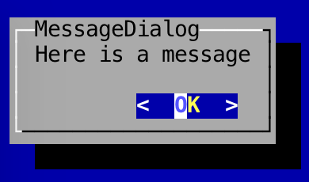

Message Dialogs
---

Message dialogs are simply pop-up messages that are shown to the user and dismissed with the "Enter" key.

To create a message dialog, as with all dialogs, you'll need to create and pass in a `WindowBasedTextGUI`:

```
	// Setup terminal and screen layers
	Terminal terminal = new DefaultTerminalFactory().createTerminal();
	Screen screen = new TerminalScreen(terminal);
	screen.startScreen();

	// Setup WindowBasedTextGUI for dialogs
	final WindowBasedTextGUI textGUI = new MultiWindowTextGUI(screen);
```

In the following example, a message box is shown to the user when the button is clicked:

```
	panel.addComponent(new Button("Test", new Runnable() {
		@Override
		public void run() {
		    MessageDialog.showMessageDialog(textGUI, "test", "test");
		}
	}));
```

As you can see, it's incredibly easy to create and show a message dialog:

```
	MessageDialog.showMessageDialog(textGUI, "Message", "Here is a message dialog!");
```

You can also use a `MessageDialogBuilder` to build up and show a message dialog:

```
	new MessageDialogBuilder()
		.setTitle("Here is the title")
		.setText("Here is a message")
		.build()
		.showDialog(textGUI);
```

You can also change the button on the `MessageDialog`:

```
	new MessageDialogBuilder()
		.setTitle("Here is the title")
		.setText("Here is a message")
		.addButton(MessageDialogButton.Close)
		.build()
		.showDialog(textGUI);
```

The following buttons are available:

- OK
- Cancel
- Yes
- No
- Close
- Abort
- Ignore
- Retry
- Continue

### Screenshot


