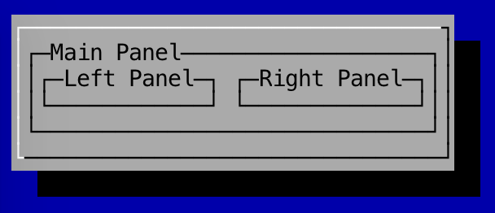

Panels
---

Panels are a way for you to split up your UI and components and group them into seperate sections, similar to JPanels in Swing.

To create a `Panel`:

```
	Panel panel = new Panel();
```

To add a component to a `Panel`:

```
	panel.addComponent(new Button("Enter"));
```

You can also nest `Panel`s:

```
	BasicWindow window = new BasicWindow();

	Panel mainPanel = new Panel();
	mainPanel.setLayoutManager(new LinearLayout(Direction.HORIZONTAL));

	Panel leftPanel = new Panel();
	mainPanel.addComponent(leftPanel.withBorder(Borders.singleLine("Left Panel")));

	Panel rightPanel = new Panel();
	mainPanel.addComponent(rightPanel.withBorder(Borders.singleLine("Right Panel")));

	window.setComponent(mainPanel.withBorder(Borders.singleLine("Main Panel")));
	textGUI.addWindow(window);
```

In the example above, the "Main Panel" holds two seperate panels: the "Left Panel" and the "Right Panel".

The left and right panels sit next to each other because a layout manager was provided:

```
	mainPanel.setLayoutManager(new LinearLayout(Direction.HORIZONTAL));
```

By default, the layout for `Panel`s is a default `LinearLayout` set to `VERTICAL`, meaning that when components are added, they will sit on top of each other rather than next to each other. More information on layout managers can be found in the layout manager section.

### Screenshot

