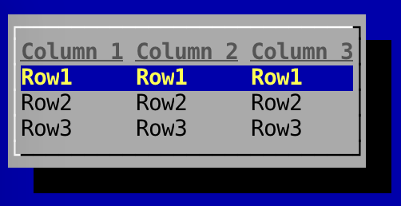

Tables
---

To create a `Table`:

```
	Table<String> table = new Table<String>("Column 1", "Column 2", "Column 3");
```

The above line will create a table with three headers.

All `Table`s have a connected `TableModel`. The `TableModel` is used to access the data within the table, add rows, add columns, etc.

To add a row:

```
	table.getTableModel().addRow("1", "2", "3");
```

When adding a row, the number of arguments much match the number of columns.

You can add a select action, which will run when a row is selected and the `Enter` key is pressed:

```
	table.setSelectAction(new Runnable() {
		@Override
		public void run() {
			List<String> data = table.getTableModel().getRow(table.getSelectedRow());
			for(int i = 0; i < data.size(); i++) {
			    System.out.println(data.get(i));
			}
		}
	});
```

The code above will print out each value in the row to the console when a row is selected and the `Enter` key is pressed.

### Screenshot

