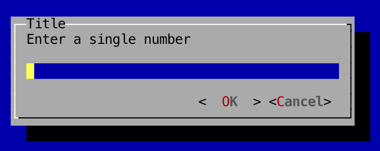
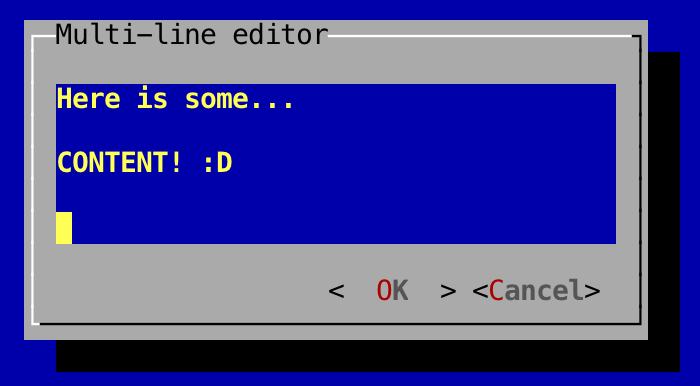

Text Input Dialogs
---

Text input dialogs are pop-up windows that allow user input.

To create an input dialog, as with all dialogs, you'll need to create and pass in a `WindowBasedTextGUI`:

```
	// Setup terminal and screen layers
	Terminal terminal = new DefaultTerminalFactory().createTerminal();
	Screen screen = new TerminalScreen(terminal);
	screen.startScreen();

	// Setup WindowBasedTextGUI for dialogs
	final WindowBasedTextGUI textGUI = new MultiWindowTextGUI(screen);
```

In the following example, an input box is shown to the user when the button is clicked and whatever is typed into the input dialog is stored in the variable `input`:

```
	panel.addComponent(new Button("Test", new Runnable() {
		@Override
		public void run() {
		    String input = TextInputDialog.showDialog(textGUI, "Title", "This is the description", "Initial content");
		}
	}));
```

As you can see, it's incredibly easy to create and show an input dialog:

```
	TextInputDialog.showDialog(textGUI, "Title", "This is the description", "Initial content");
```

You can also use a `TextInputDialogBuilder` to build up and show a text dialog:

```
	new TextInputDialogBuilder()
		.setTitle("Title")
		.setDescription("Enter a single number")
		.setValidationPattern(Pattern.compile("[0-9]"), "You didn't enter a single number!")
		.build()
		.showDialog(textGUI);
```

The `TextInputDialog` also supports multi-line text input:

```
	String result = new TextInputDialogBuilder()
		.setTitle("Multi-line editor")
		.setTextBoxSize(new TerminalSize(35, 5))
		.build()
		.showDialog(textGUI);
```

By using a builder, you can set a validation pattern, as shown above, which spits out an error if the user tries to pass in anything that doesn't match the provided regex.

### Screenshots

#### Single-line:



#### Multi-line:

